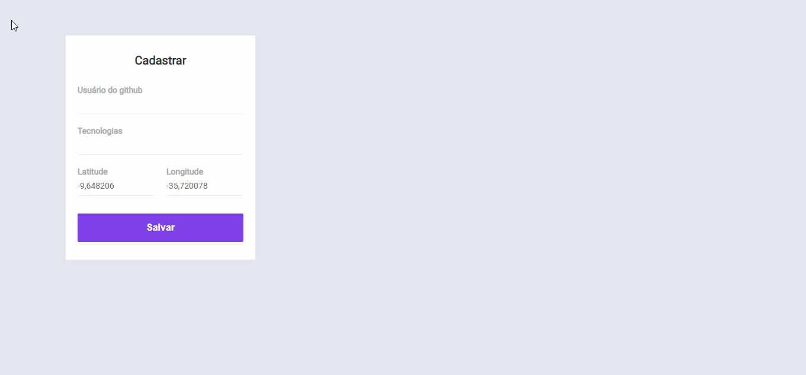

# FinDev
 
*Desenvolvido durante a Semana OmniStack 10*

Tem como objetivo conectar devs com base em sua localização e tecnologias

------
## 💻 Tecnologias
- Javascript
- Node
- Socketio
- React
- React Native
- Expo
- MongoDB

## 🚀 Instalando o projeto
Em cada pasta (**server**, **web** e **mobile**), use o comando 
`npm install` ou `yarn`

#### Server
Na pasta server use o comando
`npm run dev` ou `yarn dev`

### 📍 **Crie um arquivo .env e o preencha com as variáveis de ambiente referente ao seu banco de dados**

### Exemplo:

    DB_USER=user
    DB_PASS=password
    DB_NAME=dbname

#### Web
Na pasta web use o comando
`npm start` ou `yarn start`
#### Mobile
Na pasta mobile rode o comando
`expo start`

----
## 🐱‍👤 Autor
[Gabriel Araujo](https://github.com/araujogabriel77)

💼 **Linkedin**: [_Gabriel Ferreira_ ](https://www.linkedin.com/in/araujogabriel77/)

📩 **email**: araujogabrielocn@gmail.com

----
## 📃 License

This project is licensed under the MIT License - see the  [LICENSE.md](./LICENSE.md)  file for details